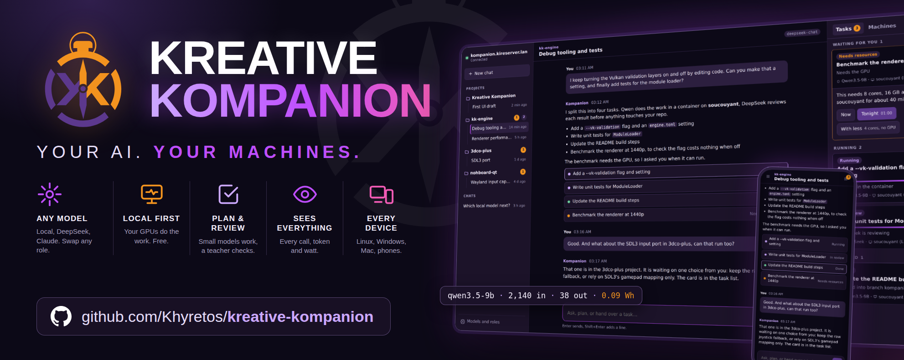
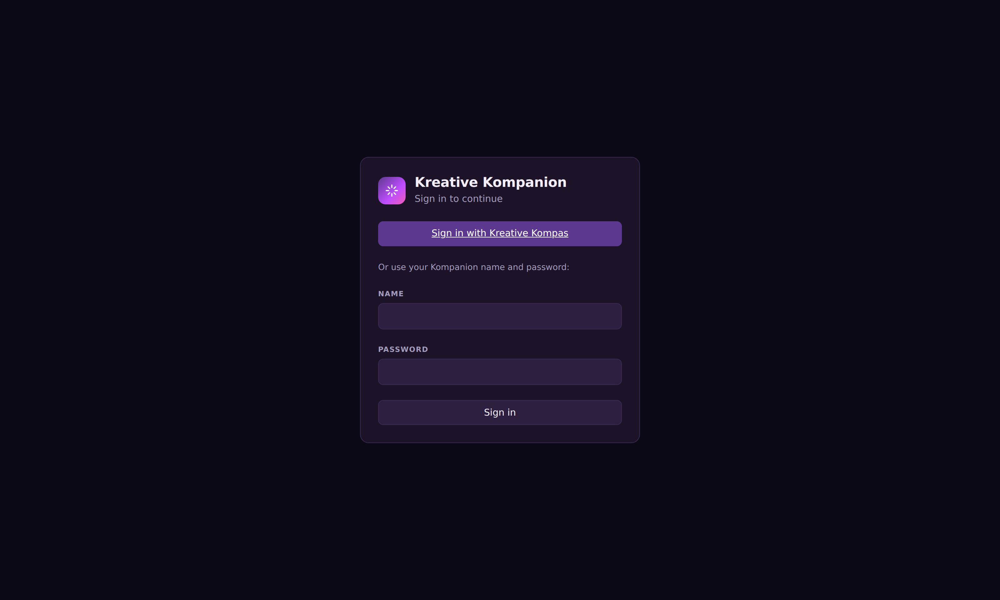
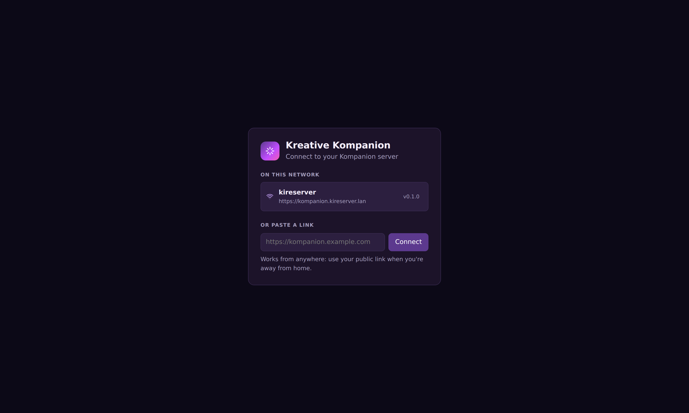
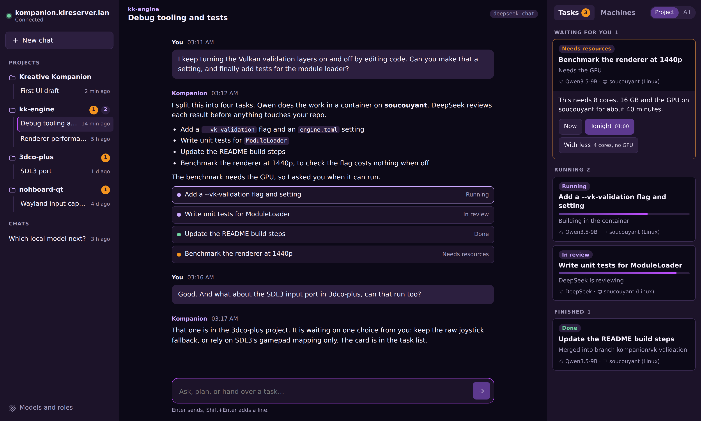
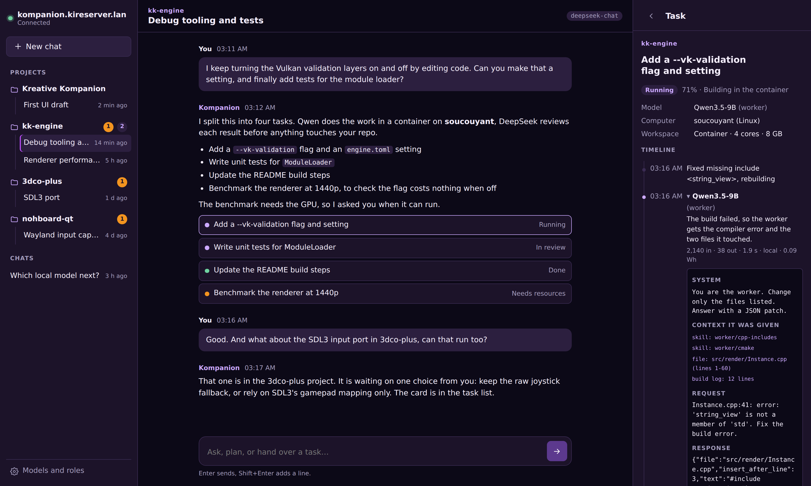
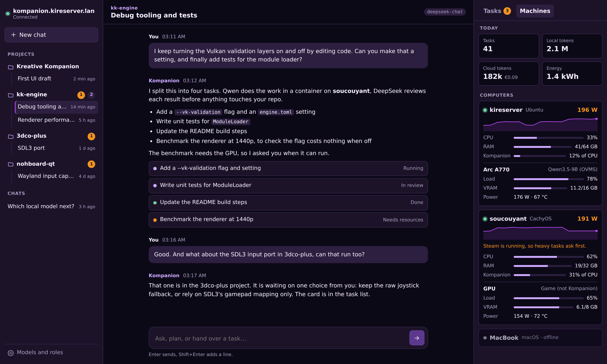
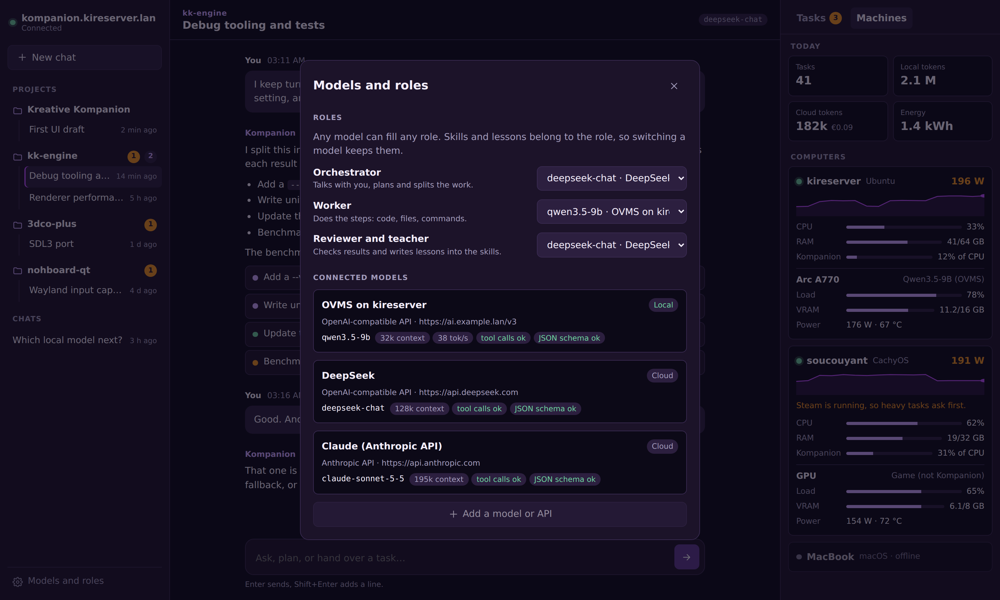
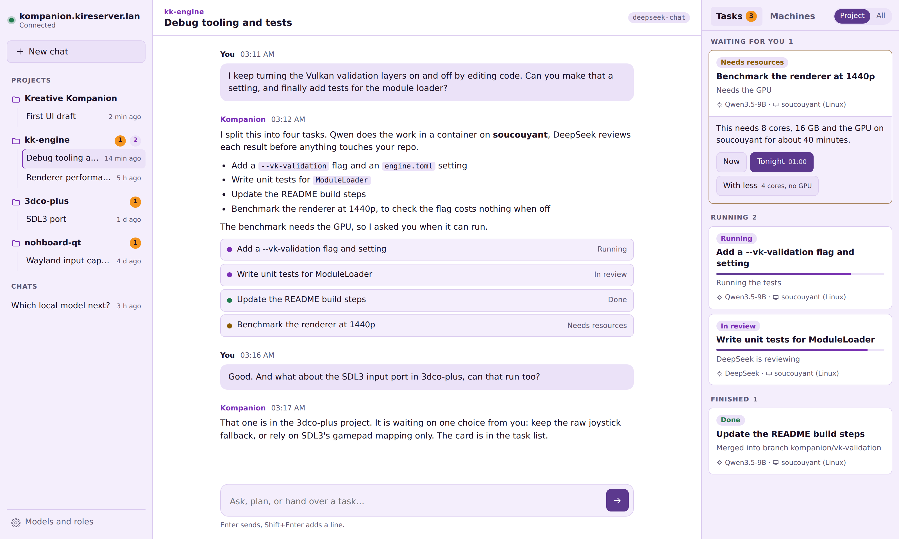
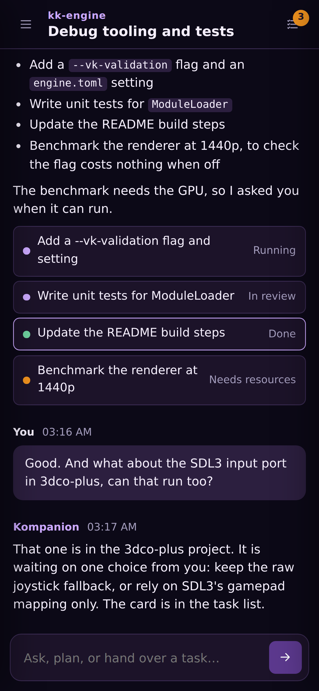

<p align="center">
  
</p>

# Kreative Kompanion

A self-hosted, FOSS "Claude-like" companion: one orchestrator you talk to per
project, tasks that run on your own computers, local models doing the work and
a stronger model reviewing and teaching them. See `docs/architecture.md`.

## Screenshots

| | |
|---|---|
|  |  |
| Sign-in with single sign-on (Keycloak or any OIDC provider) | Connect by link or find the server on your network |
|  |  |
| Projects, the orchestrator chat and running tasks | Every model call: prompt, context, answer, tokens, energy |
|  |  |
| CPU, RAM, GPU load and wattage of every machine | Any model in any role: local, DeepSeek, Claude |
|  |  |
| Kompas Day theme | On a phone |

Screens other than sign-in show demo data. The banner source is
`docs/branding/banner.html`; `docs/branding/render-banner.mjs` renders it.

## Status

Milestone 1 done, milestone 2 in progress:

- `server/` (Rust, axum, SQLite): sign-in with password or OIDC single
  sign-on, separate data per user, chats, streaming answers from any
  OpenAI-compatible or Anthropic model, model roles, a full log of every
  model call (`GET /api/calls`), tasks, and `kompanion-server import` to bring
  projects and tasks in from another planner.
- `web/` (vanilla TypeScript): talks to the server when served by it, and falls
  back to a demo with example data when opened on its own.
- Not yet: runners and machines (milestone 2), task execution (milestone 3).

## Run it

```sh
cp server/kompanion.example.toml kompanion.toml   # edit providers and roles
cp .env.example .env                              # API keys, if any
docker compose up -d
docker compose logs kompanion   # shows the one-time setup code
```

Then open the app, enter the setup code and create your account.

For development: `cd web && npm run build`, then
`cd server && KOMPANION_CONFIG=../kompanion.toml cargo run` (set
`web_dir = "../web/dist"` and, for plain http on localhost only,
`secure_cookies = false`).

## Server security

- No open endpoints except status, setup and sign-in. The first account needs a
  one-time setup code printed in the server log.
- Session cookie: random token (stored only as a SHA-256 hash), HttpOnly,
  Secure, SameSite=Strict. Passwords hashed with Argon2id; sign-in throttled.
- State-changing requests need an `X-Kompanion: 1` header and an allowed Origin.
- Strict Content-Security-Policy with Trusted Types, `nosniff`, `no-referrer`.
- Provider URLs come only from the admin's config file (no user-supplied URLs,
  so no SSRF through the API). API keys come from environment variables and are
  never stored or logged.
- The container runs as a non-root user with a read-only filesystem and no
  capabilities.

## Web app

Vanilla TypeScript, no framework. Built with esbuild; two small runtime
dependencies: `marked` (markdown) and `DOMPurify` (sanitising model output).

```sh
cd web
npm install
npm run dev        # http://localhost:5173
npm run typecheck
npm run build      # dist/
node build.mjs --single   # dist/preview.html, one self-contained file
```

Layout of `web/src`:

- `api/` types shared with the server, the `KompanionApi` interface, and the mock server
- `core/` small building blocks: escaped templates (`html`), sanitised markdown,
  a store that batches updates per animation frame, keyed list updates
- `views/` one file per screen part: connect, sidebar, conversation, tasks, machines, settings

Security rules the code follows: model text is never put into the page as raw
HTML (marked + DOMPurify, links forced to http(s) and `noopener`), templates
escape every value, a strict CSP with Trusted Types is set in `index.html`, and
approvals show the exact command, folder, machine and network targets.
